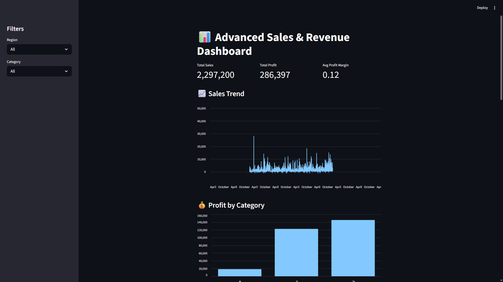
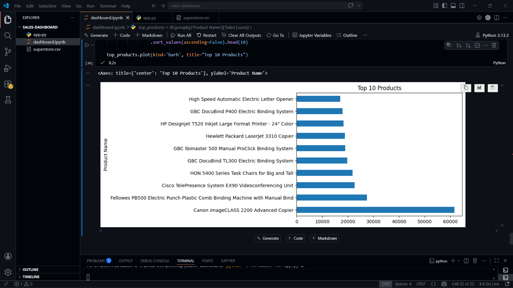
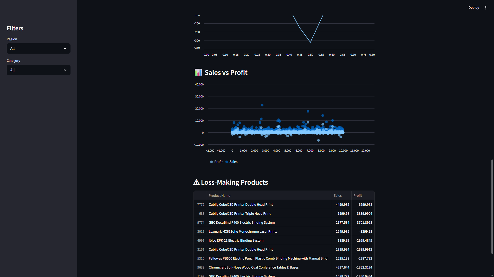

# 📊 Sales & Revenue Analysis Dashboard

## 🌐 Live Demo

https://sales-dashboard-fxqtruvx7tdpgrr5vw5aqz.streamlit.app/


## 📌 Overview

This project is an interactive data analytics dashboard built to analyze sales (revenue), profit trends, and overall business performance using a real-world retail dataset.

The dashboard allows users to explore key metrics, identify top-performing products, and uncover actionable insights through dynamic filtering and visualization.

---

## 🚀 Key Features

* 📈 **KPI Tracking**: Total Sales, Total Profit, and Profit Margin
* 🏆 **Top Products Analysis**: Identify top-performing products by revenue
* 📊 **Sales Trend Visualization**: Analyze revenue patterns over time
* 🎯 **Discount Impact Analysis**: Understand how discounts affect profitability
* ⚠ **Loss Detection**: Highlight products generating negative profit
* 🔍 **Interactive Filters**: Filter data by Region and Category

---

## 📸 Dashboard Preview

### 🏠 Main Dashboard



---

### 🎛 Filters & Interaction



---

### 📊 Charts & Insights



---

### 📈 Additional Analysis


---

## 🧠 Business Insights

* High discounts significantly reduce profit margins
* Some products generate high sales but result in losses
* Profitability varies across categories and regions
* Technology category contributes strongly to revenue

---

## 🛠️ Tech Stack

* **Python**
* **Pandas**
* **Streamlit**

---

## 📂 Dataset

* Superstore Sales Dataset (CSV format)
* Contains order-level data including sales, profit, discount, and customer details

---

## ▶️ How to Run the Project

### 1. Clone the repository

```bash
git clone https://github.com/SandeshRoy/sales-dashboard.git
cd sales-dashboard
```

### 2. Install dependencies

```bash
pip install -r requirements.txt
```

### 3. Run the application

```bash
python -m streamlit run app.py
```

---

## 💼 Project Highlights

* Built an end-to-end data analytics solution
* Applied data cleaning, feature engineering, and visualization techniques
* Developed an interactive dashboard for real-time analysis
* Generated business insights to support data-driven decision making

---

## 🔗 Future Improvements

* Deploy dashboard online using Streamlit Cloud
* Add forecasting using time-series models
* Improve UI/UX for better user experience

---

## 👨‍💻 Author

**Sandesh E J**
